# Pressure Watch
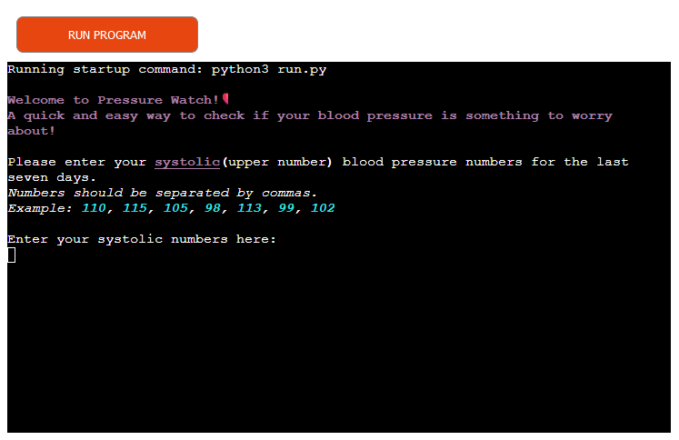

Pressure Watch is a quick and easy way to test how ones blood pressure is to be interpreted. Using a seven day average, the program gives a quick estimate if everything is normal or if medical advice should be sought out. 

The Live Link can be found here [Pressure Watch](https://pressure-watch-6b6f3a986cfe.herokuapp.com/)

## Contents

## Requirements

This website was created as the second required project for the Diploma in Full Stack Software Development from [Code Insitute](https://codeinstitute.net). 

Basic requirements:
  - A basic Command Line Interface program written with Python. 
  - Documentation and deployment via GitHub.
  - Deployment via Heroku. 
  - Readme.md documentation.
  - Manual and validator testing.

## UX

### Project Goals

- Provide information about Pressure Watch
- Provide User with input opportunity 
- Provide User with results of input
- Provide a database that stores data
- Provide calculations and actions with stored data

### User Demographic

This website is meant for:

- Users interested in a quick assessment of their blood pressure
- Users regularly checking their blood pressure

### User Experience

As a User:

- I want to find out what Pressure Watch is
- I want to be able to use an input for my own data
- I want to know what the program is doing
- I want to get results based on my provided data

### User Goals

- Find information about Pressure Watch
- Get instructions for Pressure Watch
- Put in my own data
- Get information about what the program is doing with my data
- See results for my data
- Restart the program

### Development

In the first developing stage, first notes and a flowchart were created to map out the specific steps that needed to be taken to get the data for the program, validate and store it and calculate results from it. Additionally, the user needed to be taken into account and steps for providing information needed to be included.

## Features

### Design

As the program has a basic Command Line Interface (CLI) and is therefore simply text-based, the design options were limited and focused on text design. The rich python library was used to style and color text according to its meaning.

- Welcome and End message are displayed in bold magenta and include a heart icon, relating to the topic of the program
- Numbers are shown in lightblue by default which makes for easier distinction
- Example and extra information is shown in italic to separate it from the rest of instructions
- Program processes are shown in yellow and italic to signal a working process
- Successful processes are shown in green and italic to let the user know everything is working as wanted
- Error messages are shown in red to signal a problem to the user
- Results are shown in bold text to highlight their importance
    - Additionally, final results are colored in red if blood pressure is alarming and medical advice should be sought out or in green if blood pressure is normal

### Welcome Message

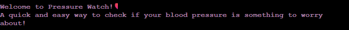

### Introductions and User Input

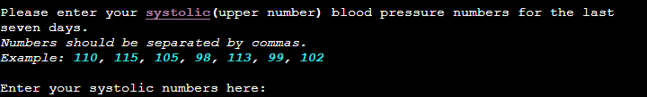
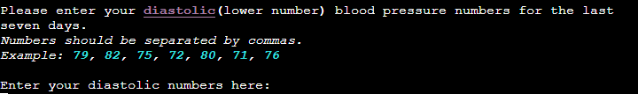

### Data Validation

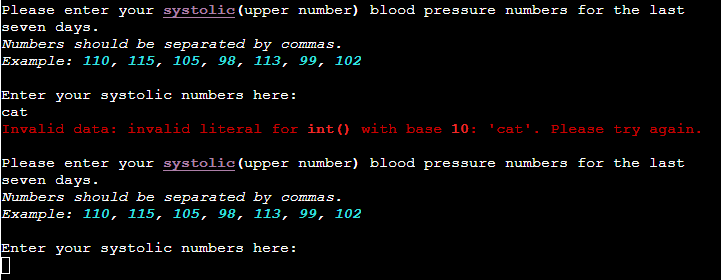

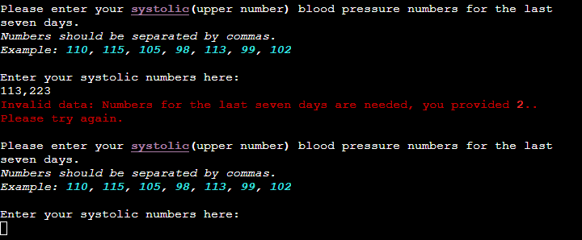

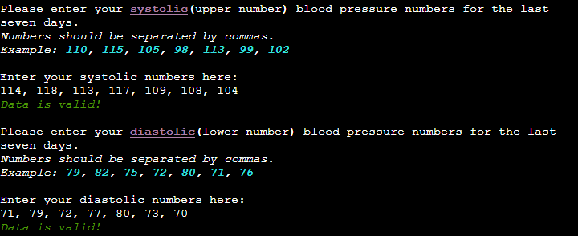

### Pressure Database Update

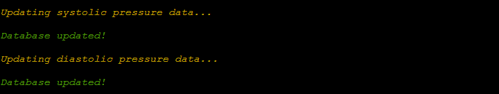

### Average Pressure Calculation and Result

### Average Database Update

)

### Checking Classification Database Update

### Classification Result

### End and Restart Message

### Error Page

## Google Sheets

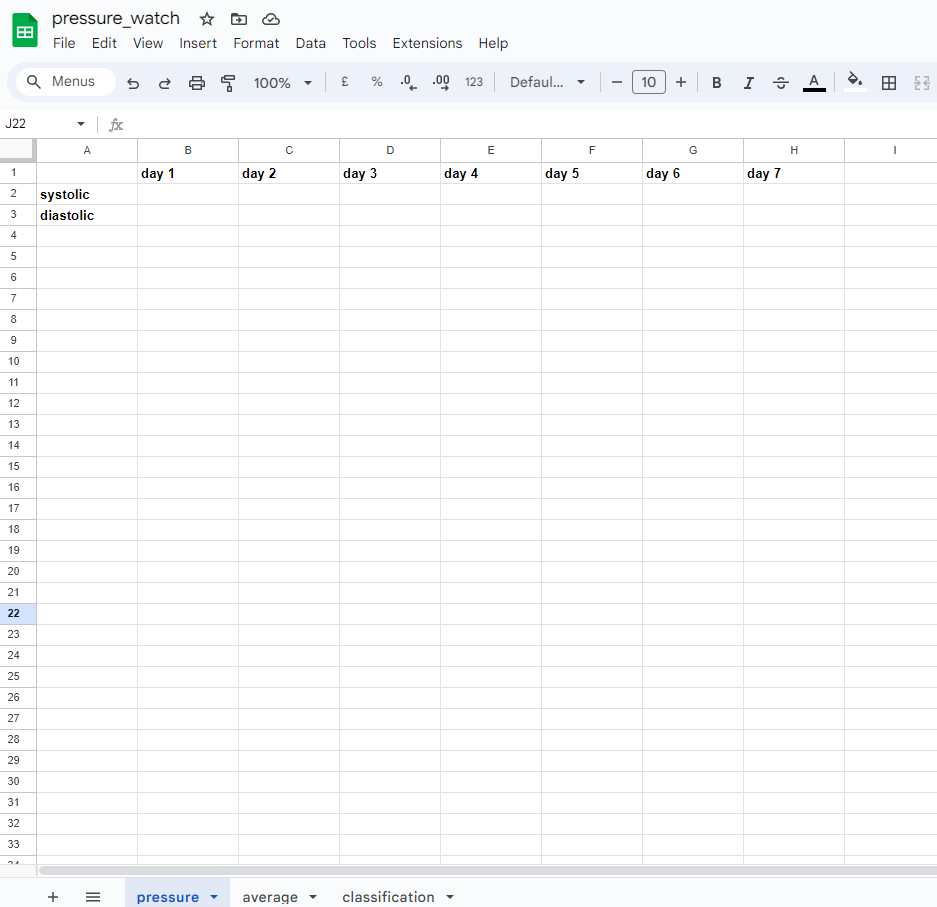
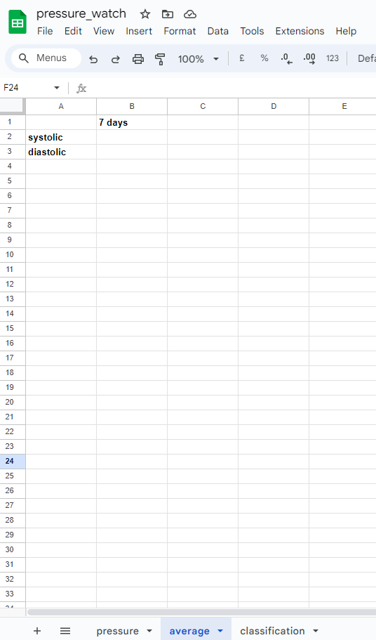
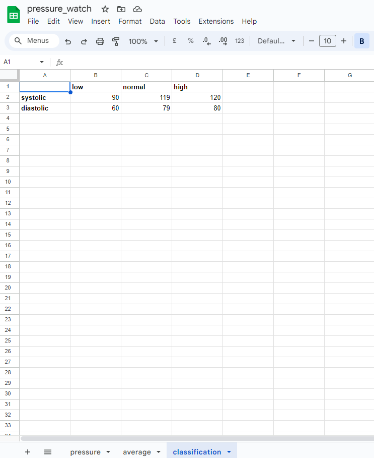

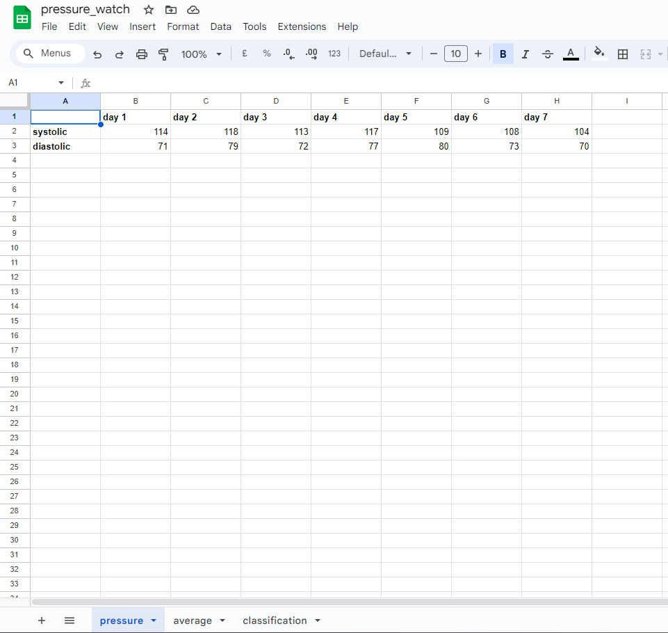

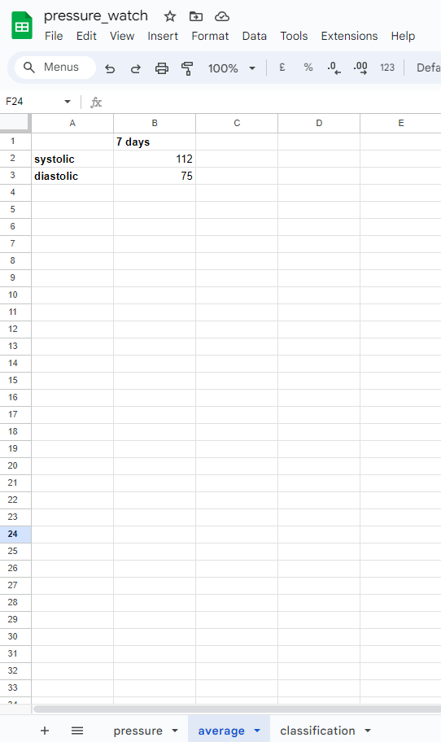

## Testing and Validation

The program has been tested and its code validated, the results can be viewed here [TESTING](https://github.com/anchvo/pp3-pressure-watch/blob/main/TESTING.md)

## Bugs

## Technologies Used

Main language: Python

Websites:
- GitHub
- GitPod
- Google Sheets
- Google Cloud
- Heroku

### Libraries

- The [rich library](https://pypi.org/project/rich/) for text design and formatting
- The [gspread library](https://pypi.org/project/gspread/) for working with Google Sheets
- The [google auth library](https://pypi.org/project/google-auth/) for simplified use of Google’s various server-to-server authentication mechanisms to access Google APIs

## Deployment

### GitHub

-__On GitHub, the project was set up via the following steps:__

- Log in to GitHub and create repository.
- Use the [Code Institute Project 3 Template](https://github.com/Code-Institute-Org/p3-template).
- Use the code to set up workspace on GitPod or preferred workspace

### Google Sheets

-__The data storage was set up on Google Sheets via the following steps:__

- Log in to Google and create new Sheet with necessary starting data.
- Open Google Cloud and create new project.
- Navigate to APIs and services > libray.
- Enable Google Drive API and Google Sheets API.
- Navigate to APIs and services > credentials.
- Create credentials / service account and download json file.
- Go to Google Sheet and share it by passing in service account email.
- Copy json file to project code in workspace and rename creds.json for easier access

### Heroku

- __The website was deployed to Heroku via the following steps:__

- In code workspace, add necessary requirements to requirements.txt.
- Log in to Heroku and create new App.
- In App settings, set the necessary _Config Vars_:
    - Key `PORT` and value `8000`
    - Key `CREDS` and value `contents of credentials.json file`
- In App settings, add two buildpacks in the following order:
    1. `heroku/python`
    2. `heroku/nodejs`
- In Deployment tab, connect to GitHub.
- Search for project on GitHub.
- Enable automatic deploys if wanted.
- Deploy GitHub branch.

## Future Updates

## Credits

### Help, Advice and Inspiration

### Code

### Content

