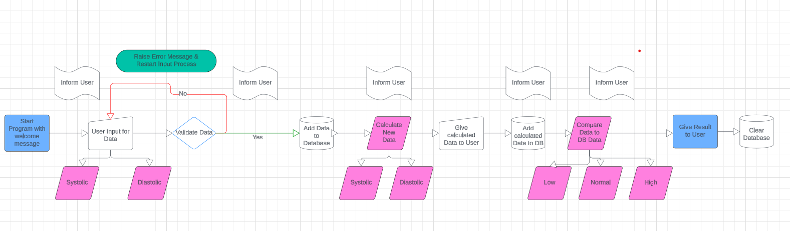
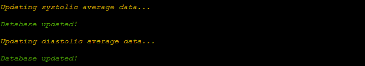
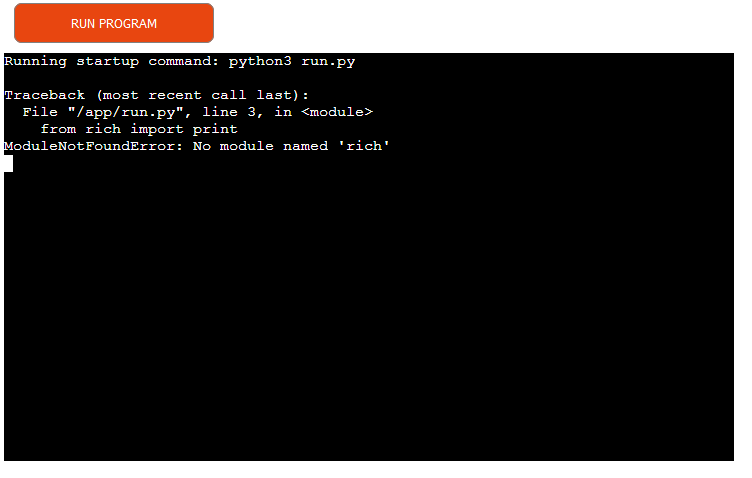
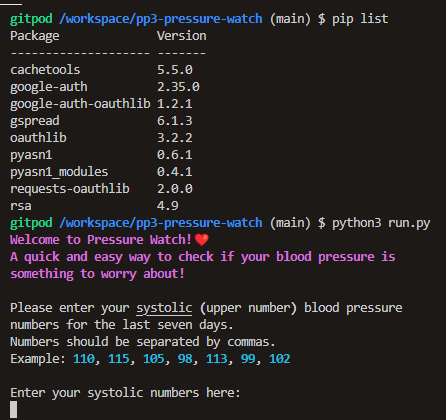
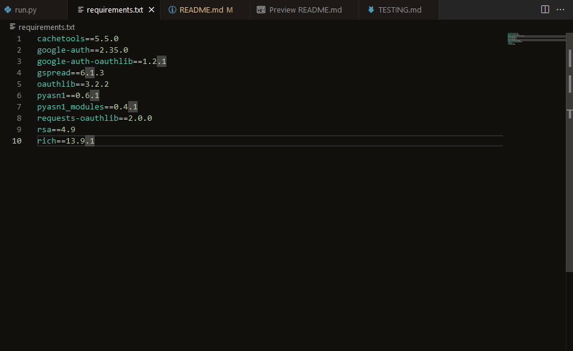

# Pressure Watch

Pressure Watch is a quick and easy way to test how ones blood pressure is to be interpreted. Using a seven day average, the program gives a quick estimate if everything is normal or if medical advice should be sought out. 

The Live Link can be found here [Pressure Watch](https://pressure-watch-6b6f3a986cfe.herokuapp.com/)

### Notes

For easier testing of results, find a set of testing numbers to enter in the user input below.
- low numbers (systolic, diastolic):
    - 81, 85, 87, 90, 88, 82, 91
    - 60, 59, 57, 61, 56, 59, 58
- high numbers (systolic, diastolic):
    - 120, 124, 130, 154, 133, 129, 140
    - 81, 89, 91, 84, 79, 88, 93
- normal numbers (systolic, diastolic):
    - 114, 118, 113, 117, 109, 108, 104
    - 71, 79, 72, 77, 80, 73, 70

## Contents

- [Requirements](#requirements)
- [UX](#ux)
    - [Project Goals](#project-goals)
    - [User Demographic](#user-demographic)
    - [User Experience](#user-experience)
    - [User Goals](#user-goals)
- [Development](#development)
- [Features](#features)
    - [Design](#design)
    - [Welcome Message](#welcome-message)
    - [Instructions and User Input](#instructions-and-user-input)
    - [Data Validation](#data-validation)
    - [Pressure Database Update](#pressure-database-update)
    - [Average Pressure Calculation and Result](#average-pressure-calculation-and-result)
    - [Average Database Update](#average-database-update)
    - [Checking Classification Database Update](#checking-classification-database-update)
    - [Classification Result](#classification-result)
    - [Clearing Google Sheet](#clearing-google-sheet)
    - [End and Restart Message](#end-and-restart-message)
- [Google Sheets](#google-sheets)
- [Testing and Validation](#testing-and-validation)
- [Bugs](#bugs)
- [Technologies Used](#technologies-used)
    - [Libraries](#libraries)
- [Deployment](#deployment)
    - [GitHub](#github)
    - [Google Sheets and Google Cloud](#google-sheets-and-google-cloud)
    - [Heroku](#heroku)
- [Future Updates](#future-updates)
- [Credits](#credits)
    - [Help, Advice and Inspiration](#help-advice-and-inspiration)
    - [Code](#code)
    - [Content](#content)

## Requirements

This website was created as the second required project for the Diploma in Full Stack Software Development from [Code Insitute](https://codeinstitute.net). 

Basic requirements:
  - A basic Command Line Interface program written with Python. 
  - Documentation and deployment via GitHub.
  - Deployment via Heroku. 
  - Readme.md documentation.
  - Manual and validator testing.

## UX

### Project Goals

- Provide information about Pressure Watch
- Provide User with input opportunity 
- Provide User with results of input
- Provide a database that stores data
- Provide calculations and actions with stored data

### User Demographic

This website is meant for:

- Users interested in a quick assessment of their blood pressure
- Users regularly checking their blood pressure

### User Experience

As a User:

- I want to find out what Pressure Watch is
- I want to be able to use an input for my own data
- I want to know what the program is doing
- I want to get results based on my provided data

### User Goals

- Find information about Pressure Watch
- Get instructions for Pressure Watch
- Put in my own data
- Get information about what the program is doing with my data
- See results for my data
- Restart the program

## Development

In the first developing stage, first notes and a flowchart were created to map out the specific steps that needed to be taken to get the data for the program, validate and store it and calculate results from it. Additionally, the user needed to be taken into account and steps for providing information needed to be included.

The flowchart was created with [Lucid App](lucid.app)

## Features

### Design

As the program has a basic Command Line Interface (CLI) and is therefore simply text-based, the design options were limited and focused on text design. The rich python library was used to style and color text according to its meaning.

- Welcome and End message are displayed in bold magenta and include a heart icon, relating to the topic of the program
- Numbers are shown in lightblue by default which makes for easier distinction
- Example and extra information is shown in italic to separate it from the rest of instructions
- Program processes are shown in yellow and italic to signal a working process
- Successful processes are shown in green and italic to let the user know everything is working as wanted
- Error messages are shown in red to signal a problem to the user
- Results are shown in bold text to highlight their importance
    - Additionally, final results are colored in red if blood pressure is alarming and medical advice should be sought out or in green if blood pressure is normal
- Throughout the project, the text is broken into multiple new lines to create space between the different displays and increase readability for the user

### Welcome Message

- The welcome message is display at the beginning and shows as soon as the program starts running
- It gives the user the name of the program and a short overview of what the program is about in a humorous way
- The heart icon relates to the topic matter and breaks up the text
    - Due to differences in operating systems and browsers, the heart might not be shown correctly

### Instructions and User Input

- The instructions and user input are split into two different sets because the user is asked to put in two sets of data
- The first instructions message and user input are displayed directly after the welcome message as soon as the program starts running

- The second instructions message and user input are displayed after the first set of data is entered and validated. 

- Each instructions message contains further information about how to enter the data and an example, to avoid any misunderstandings for the user
- The user input is bound to data validation processes and will continue to display again until valid data is entered

### Data Validation

- The data validation is bound to the user input and checks if the entered data is correct based on the following parameters:
    - The value entered has to be a number
    - The number of values entered need to be 7 exactly, no more no less
- If the data entered is validated and correct, the program continues and a message is displayed, letting the user know that their data is valid

- If the data entered is incorrect in terms of something other than a number was entered, an error message reciting the problem is displayed, asking the user to try again, followed by the respective instructions message and user input displaying again

- If the data entered is incorrect in terms of an incorrect amount of values was entered , an error message reciting the problem is displayed, asking the user to try again, followed by the respective instructions message and user input displaying again

### Pressure Database Update

- The pressure database update is split into two sets of messages, relating to the two different sets of data entered by the user
- All messages are displayed after both sets of data were entered and validated
- First, a message informing about the database update of the first set of data (systolic) is displayed, relating to the function running in the background
- When the database update was successful, a message informing the user of this is displayed
- After that, the same process repeats for the second data set (diastolic), with the user being informed about the database updating and the successful update
- In the background, the data entered via each input is added to the Google Sheet and the relating pressure worksheet

### Average Pressure Calculation and Result

- The average pressure calculation is again split into two parts relating to each data set
- The calculation starts running as soon as the databases are updated
- The user is first informed of the calculation running via a displayed message
- When the calculation is finished, the result is displayed to the user
    - The result is based on the entered pressure data and the calculated average for the entered seven days
- The same process of calculation running message and calculation result is repeated for both data sets (systolic and diastolic)
- In the background, the program calculates the sum of each entered data set and divides it by 7 (the amount of days), calculating the average for each data set

### Average Database Update

- After the calculation of the average pressure and the display of the results, the programm adds those results to the respective database
- The user is informed about each step of this update, with a update process running and a data updated message for each set of data displaying after another
- In the background, the program adds each calculated average to the Google Sheet and the relating average worksheet

### Checking Classification Database Update

- A message is displayed, informing the user that the classification database is being checked
- This relates to the classification for low, normal and high blood pressure, which are necessary for calculating a result about which category a users entered data falls under
- In the background, the program gets the saved classification data from the Google Sheet and the relating classification worksheet

### Classification Result

- Based on the gathered classification data and the calculated average data from the user input, a result comparing both is displayed to the user
- If the average blood pressure from the user input is below or equal to the low blood pressure classification data, the result displayed to the user informs about this and advises to seek medical advice

- If the average blood pressure from the user input is above or equal to the high blood pressure classification data, the result displayed to the user informs about this and advises to seek medical advice

- If the average blood pressure is classified as neither of the above, it falls under the normal blood pressure classification and the user is informed about this but advised to still do regular check-ups

- In the background, the program gets the data for low and high blood pressure from the Google Sheet and the relating classification worksheet

- The data is then compared to the calculated average blood pressure of the user and a result is chosen

### Clearing Google Sheet

- After the results are shown, the program runs a clear input function that clears the user input data and the calculated data from the pressure and average worksheets of the Google Sheet
- This allows the program to run again and store the new data in the correct positions of the worksheets, so all functions and calculations work as intended

### End and Restart Message

- The end of the program comes after the results are shown and all functions were called
- The user is informed of this via an end message, thanking them for using the program
- The user is also informed, that they can run the program again by clicking the "Run Program" button at the top

## Google Sheets

The used Google Sheet "Pressure Watch" was created with a personal Google Account and serves as the database for the program.

- At the start of the program, the worksheets "pressure" and "average" only contain data descriptions, with the cells used for the data / numbers being empty. This will be updated after the user input and calculations run through
- This is also the state to which both worksheets return to after the [Clearing Google Sheet](#clearing-google-sheet) function is called and deletes the data

- The "classification" worksheet contains both data descriptions and necessary data / numbers for the classifications of low, normal and high blood pressure
- As none of these numbers are to be changed as they are set, they are preset and only read from the sheet to be used in calculations for the end result

- After the user has put in their two sets of data, the [Pressure Database Update](#pressure-database-update) and its relating function fill in the entered data into the "pressure" worksheet

- The data entered in the "pressure" worksheet is then used to calculate an average for each data set and the calculation results are then filled into the "average" worksheet by the relating function of the [Average Database Update](#average-database-update)

## Testing and Validation

The program has been tested and its code validated, the results can be viewed here [TESTING](https://github.com/anchvo/pp3-pressure-watch/blob/main/TESTING.md)

## Bugs

During the development of the project, multiple minor bugs were encountered and solved:

- The function getting the data from the user input was first set as one function. After running the program, an error led to only the first set of data entered being passed as values, overwriting the second set. This was solved by splitting the function into two (get_pressure_data_one and get_pressure_data_two). This also resulted in the following split of functions into two variants for each data set

- When getting the data from the worksheet itself, the values return in a list of lists. Simple conversion to integers needed for calculations were not possible and led to an error. This was solved by first reading the list of lists into a new single list and then converting the new list to integers

- The append.row method with only the data passed as an argument led to the data being written wrongly into the worksheets, overwriting the preset data descriptions. This was solved by also passing the method a range of or specific cell via A1 notation, that referred to the location the data should be written into 

During the deployment on Heroku, a major bug was encountered and solved via the help of the Code Institute Tutoring option:

- The rich libary was used to design the text of the program. When first installed via "pip3 install rich" in the console, the console returned that the library was already installed. When imported in the code via "from rich import print", the methods and functions of the rich library worked correctly and showed in the console in GitPod when the program was run. The library was not passed into the requirements.txt when it was created however and therefore also not installed by Heroku when the program was deployed. This lead to an error on Heroku

- As the distinct workings of libraries and the make-up of the other files of the used template were unknown, tutor support was contacted to help solve the error. When troubleshooting, calling the pip list directly from the console, also showed that the rich library was not included, although its functions worked as wanted

- In agreement with the tutor, the problem was solved by manually adding the rich library to the requirements.txt and redeploying the program on Heroku

## Technologies Used

Main language: Python

Websites:
- GitHub
- GitPod
- Google Sheets
- Google Cloud
- Heroku

### Libraries

- The [rich library](https://pypi.org/project/rich/) for text design and formatting
- The [gspread library](https://pypi.org/project/gspread/) for working with Google Sheets
- The [google auth library](https://pypi.org/project/google-auth/) for simplified use of Google’s various server-to-server authentication mechanisms to access Google APIs

## Deployment

### GitHub

-__On GitHub, the project was set up via the following steps:__

- Log in to GitHub and create repository
- Use the [Code Institute Project 3 Template](https://github.com/Code-Institute-Org/p3-template).
- Use the code to set up workspace on GitPod or preferred workspace
- Optional: fork or clone the repository by creating a new branch

### Google Sheets and Google Cloud

-__The data storage was set up on Google Sheets via the following steps:__

- Log in to Google and create new Sheet with necessary starting data
- Open Google Cloud and create new project
- Navigate to APIs and services > libray
- Enable Google Drive API and Google Sheets API
- Navigate to APIs and services > credentials
- Create credentials / service account and download json file
- Go to Google Sheet and share it by passing in service account email
- Copy json file to project code in workspace and rename creds.json for easier access

### Heroku

- __The website was deployed to Heroku via the following steps:__

- In code workspace, add necessary requirements to requirements.txt.
- Log in to Heroku and create new App
- In App settings, set the necessary _Config Vars_:
    - Key `PORT` and value `8000`
    - Key `CREDS` and value `contents of credentials.json file`
- In App settings, add two buildpacks in the following order:
    1. `heroku/python`
    2. `heroku/nodejs`
- In Deployment tab, connect to GitHub
- Search for project on GitHub
- Enable automatic deploys if wanted
- Deploy GitHub branch

## Future Updates

The program could be improved by various future updates, including:

- Additonal data validation to set tighter constraints for what data can be entered e.g. a specific number range for the values
- The option for the user to put in additional data, especially for a second week of blood pressure numbers, allowing for a better overall result
- The option to end the program with a user input and only delete the data then
- Code optimisation to minimise repeated code. Especially when more used to working with Python and more advanced in the learning stage, optimisation processes should be considered

## Credits

### Help, Advice and Inspiration

- Jubril Akolade - my mentor
- Sarah from tutor support

### Code

- Trouble-Shooting for bugs and learning about additional code options was assissted by using [W3Schools](https://www.w3schools.com/) and [MDN Web Docs](https://developer.mozilla.org/en-US/)
- The SCOPE setup and constant variables used in the project were taken and modified from the [Love Sandwiches Walkthrough](https://github.com/anchvo/love-sandwiches-walkthrough) project that was created during the course with [Code Institute](https://codeinstitute.net)
- The starting functions to get_pressure_data_one, get_pressure_data_two and validate_pressure_data were inspired and modified from the versions in the [Love Sandwiches Walkthrough](https://github.com/anchvo/love-sandwiches-walkthrough) project that was created during the course with [Code Institute](https://codeinstitute.net)

### Content

- The content and the necessary data for the classification of blood pressure were taken from [heart.org](https://www.heart.org/en/health-topics/high-blood-pressure/the-facts-about-high-blood-pressure/low-blood-pressure-when-blood-pressure-is-too-low)

